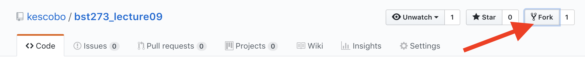
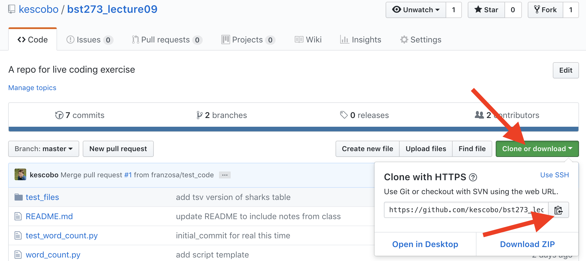

# Lecture 09 and 10 Live coding

Repo for creating a python version of
the command line tool `wc`.

## Using this repo

### Step 1 - install git

First, make sure git is installed. You should be able to run

```sh
$ git --help
```

from your terminal or anaconda prompt.

If you didn't do this in class on Tuesday,
take a look at the slides on Canvas for some instruction.

You should also configure git on your local machine to have your name and
e-mail address. [See here][1] for more info

[1]: https://git-scm.com/book/en/v2/Getting-Started-First-Time-Git-Setup

```
$ git config --global user.name "John Doe"
$ git config --global user.email "johndoe@example.com"
```

### Step 2 - fork the repo

To do this, you'll need a github account.
If you don't have one, go to [github.com](https://github.com/) and sign up.

(Please note: if you have an objection to signing up for github,
talk to Kevin after class)

Next, from the repository on github, click the "Fork" button.



This is essenitally cloning the repo to your own github account.
github tracks where you forked from,
and makes it easy to collaborate going forward.

### Step 3 - clone the repo

**Option 1: Start from scratch**: If you cloned the repo on Tuesday,
it's probably easiest to delete that folder and start over.
If you didn't clone the repo, you should start here.

From your fork on github, click the Clone or Download button,
then copy the url
(either select and copy, or click the copy to clipboard button).



Then, in your terminal or anaconda prompt, use `git clone <url>`

**NOTE: be sure to use the url from your fork, not the url below!**

```sh
$ git clone https://github.com/Bonham-Sandbox/bst273_lecture09.git
Cloning into 'bst273_lecture09'...
remote: Enumerating objects: 23, done.
remote: Counting objects: 100% (23/23), done.
remote: Compressing objects: 100% (20/20), done.
remote: Total 23 (delta 5), reused 18 (delta 2), pack-reused 0
Unpacking objects: 100% (23/23), done.
```

This creates a new folder `bst273_lecture09/` in your current directory,
and also sets the repository on github as the "remote"
(the repository) that you'll push to by default.
This remote is called `origin`,
but you can name it whatever you like (google to find out how).

```sh
$ cd bst273_lecture09/
$ git remote
origin
$ git remote get-url origin
https://github.com/Bonham-Sandbox/bst273_lecture09.git
```

**Option 2: use the same folder from Tuesday**: If you cloned the repo
on Tuesday, and you want to be a bit more advanced,
you can use the same folder.
At this point, your local repo is probably behind
since I've made commits in the meantime.
You may also have made some commits that will conflict with the ones I made
and cause issues.

**NOTE:** If you care about saving the changes you've made,
you'll have to move them to a new branch
([see here - do this before moving to the next step](https://stackoverflow.com/questions/1628563/move-the-most-recent-commits-to-a-new-branch-with-git)).

First, we'll want to get our histories synced up.
The easiest way to do this is to reset your local repo to match mine.
First, use `git fetch` to get the remote version of the history.

```sh
$ git fetch origin
```

Because your local repository was cloned from my github account,
right now your `origin` branch points there instead of to your fork.

Now, use `git reset` to overwrite your current repo to match the one online.
The `--hard` option removes any new files or changes.
First, make sure you're on the master branch:

```sh
$ git checkout master
# you'll get some outut here
$ git reset --hard origin/master
```

Now, you'll want to change the remote to point to your repo instead of mine.
Usually, we name the main remote `origin`,
but right now _my_ github is your origin, so we need to rename it.
It's customary to name the repo you forked from `upstream`,
but you can name it anything you like. This works a bit like the `mv` command,
`git remote rename <from> <to>`. Eg:

```sh
$ git remote rename origin upstream
```

Now, you'll want to add your fork to be a new remote
(again, use the specific url from your fork, don't just copy paste the url below). The command is `git remote add <name> <url>`.

```sh
$ git remote add origin https://github.com/Bonham-Sandbox/bst273_lecture09.git
$ git remote
origin
upstream
```

As you can see, we now have two remotes we can potentially point to.
The last thing we want to do is set our new `orgin` to be the remote we push to

```sh
$ git push --set-upstream origin master
```

### Step 4: Make a new branch for your changes

Usually it's a good idea to use the `master` branch for "working" code
(for some definition of working).
And if you're collaborating or working off someone else's repo,
you should never make commits to `master` - that's up to them.
Instead, we'll do our work on a branch, and then open a "pull request"
if we think our changes should go on `master`.

To make a new branch, use `git checkout -b <branch-name>`.
This creates the branch, and moves you onto it.
Now, new commits will live on this branch.

```sh
$ git checkout -b kevdev # use whatever name you like
```
